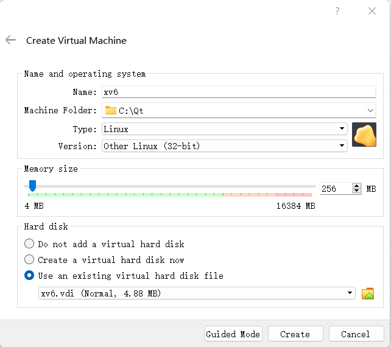
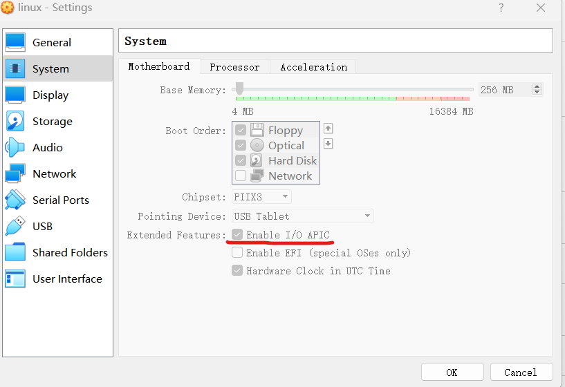
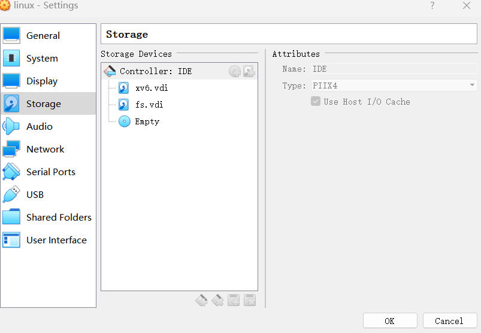

# Build
## Ubuntu 22.04 x64
1. sudo apt install qemu-system-x86
2. make
3. make qemu
4. If get the following error:
```
gcc -fno-pic -static -fno-builtin -fno-strict-aliasing -O2 -Wall -MD -ggdb -m32 -Werror -fno-omit-frame-pointer -fno-stack-protector -fno-pie -no-pie   -c -o usertests.o
usertests.c

usertests.c: In function ‘sbrktest’:
usertests.c:1461:13: error: writing 1 byte into a region of size 0 [-Werror=stringop-overflow=]
 1461 |   *lastaddr = 99;
 ```
 compiler again by remove ```-Werror```:
 ```
 gcc -fno-pic -static -fno-builtin -fno-strict-aliasing -O2 -Wall -MD -ggdb -m32 -fno-omit-frame-pointer -fno-stack-protector -fno-pie -no-pie   -c -o usertests.o usertests.c
 make qemu
 ```
 
 # Run on VirtualBox
 ## Windows 11
 1. change .img to .vdi
 ```
 C:\Program' 'Files\Oracle\VirtualBox\VBoxManage convertfromraw --format VDI .\xv6.img .\xv6.vdi
 C:\Program' 'Files\Oracle\VirtualBox\VBoxManage convertfromraw --format VDI .\fs.img .\fs.vdi
 ```
 2. Create Virtual Machine, choose ```type: Linux and version: Other Linux (32 bit)```

 </img>

 3. In Settings, enable ```I/O APIC```
 
 </img>
 
 4. In Settings, add xv6.vdi and fs.vdi in IDE
 
 </img>
